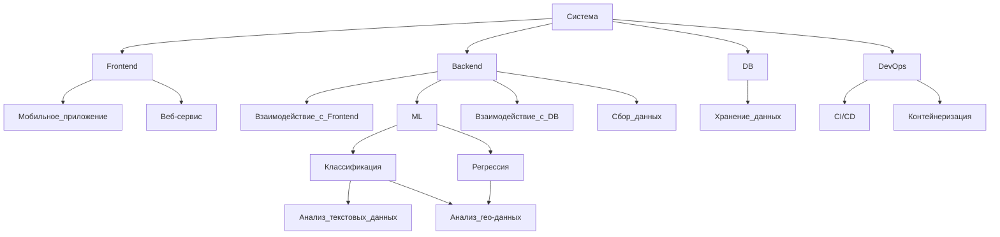

# DB-SFD-Healthy-City
Реализуем кейс от площадки "Цифровой прорыв (ЮФО)".
Кейсосодерждатель - ФГБУ «НМИЦ ТПМ» Минздрава России.

## Описание исходной задачи
Формирование здоровьесберегающей среды является основой Федерального проекта «Укрепление общественного здоровья» в рамках Национального проекта «Демография». Формирование здоровьесберегающей среды – это самый эффективный и экономически целесообразный способ увеличения продолжительности жизни и сохранения трудовых ресурсов. Однако формирование среды является сложным процессом, требующим межсекторального взаимодействия и широкого круга компетенций, не только в вопросах здоровья, но и градостроительства, коммуникаций и др. В России отмечается дефицит как специалистов, так и инструментов в этой области. 
На основе открытых источников (Open Street Map), с применением технологий искусственного интеллекта, участникам хакатона нужно создать MVP в виде веб-приложения для оценки городской инфраструктуры. 
Основной же задачей участников будет формирование рекомендаций по улучшению среды проживания в выбранной зоне (увеличение или уменьшение указанных выше показателей относительно зон-примеров - городов со всего мира, к показателям которых нужно стремиться).  Разработанный продукт (цифровой инструмент) позволит формировать региональные и муниципальные программы укрепления общественного здоровья, включая анализ доступности алкоголя, табака, продуктов питания и возможностей для физической активности.

## Описание решения
В рамках решения предлагается веб-сервис, основанный на RESTful клиент-серверной архитектуре, поддерживаеммый большинством современных браузеров, а также мобильной ОС Android версии ??.
### Аннотация
Реализованный проект предоставит возможность пользователю интерактивную платформу, позволяющую выбрать необходимый для анализа регион и получить краткую и более полную аналитику с точки зрения инфраструктуры. Сервис ориентируется не только на гео- и климатические данные, но также анализирует новостные справки и социальные медиа относительно выбранного региона.
### Архитектура
#### Главные компоненты

### Основной функционал
#### Используемые метрики для анализа
### Список открытых источников
Геоданные:
  - [OSM(Open Street Map)](https://www.openstreetmap.org/#map=3/69.62/-74.90)
  - [Gismeteo](https://www.gismeteo.ru/api/)
Новостные ресурсы:
- [ВК API](https://vk.com/feed)
### Использованные средства разработки
#### IDE/IDLE
- 
- 
#### Описание стека
- ЯП:
  - 

- Фреймворки/технологии:
  - 

### Ссылки на исходный код системных компонент
- База данных
- Серверная часть
- Front-end web часть
- Front-end mobile часть
- [UI/UX дизайн](https://www.figma.com/file/T0441FbXWMXjQ24HL5ZhTt/MLS(DBSFD)?type=design&node-id=0%3A1&mode=design&t=Ixji2eeGdy7GpLNj-1)
